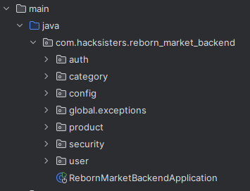

# Reborn Market - Backend

## Table of Contents
- [Project Description](#project-description)
- [Key Features](#key-features)
- [Project Structure](#project-structure)
- [Api Endpoints](#api-endpoints)
---
## 💡Project Description
We have developed this project with the specifications that were given to us at the beginning of the F5 Hackathon. Following the theme of the event, we have developed a market place. On this website you will be able to sell products related to parenting, from clothes to toys... We have implemented a basic auth, a small api and a database with PostgreSQL and Docker.

## 🚀Key Features
### 📜 Product Management
- Create a new product
- Update a exists product
- Delete a exists product
### 👤 User Management
- Basic Auth
---
## 📂Project Structure
The project follows the principle of separation of features.


---
## 📦API Endpoints
URL: http://localhost:8080/api/v1/ + endpoint
### Product Endpoints
| Method | Endpoint         | Description              |
|--------|------------------|--------------------------|
| GET    | `/products`      | Retrieve all products.   |
| POST   | `/products`      | Register a new product.  |
| PUT    | `/products/{id}` | Update product details.  |
| DELETE | `/prpducts/{id}` | Delete an product by ID. |

---
## ✍️Working examples
### Create product
**POST** `http://localhost:8080/api/v1/products`

```json
{
  "reservedSeats": 180,
  "flightId": 2,
  "userId": 2
}
```

---
## 🛠️Technologies Used
- **Java 21**: Programming language.
- **Spring Boot**: Framework for building REST APIs.
- **Maven**: Build tool.
- **PostgreSQL**: Database, deployed using Docker.
- **Docker**: Used for containerizing the PostgreSQL database.
- **Docker Compose**: Orchestrates multi-container Docker applications.
- **H2 Database**: In-memory database for temporary data storage.

---

## ⚙️Installation and Setup

1. **Clone the repository**:

```bash
git clone https://github.com/HackSisters/reborn-market-backend.git
```

2. **Configure the database in the application properties**:
- This project has two different configurations for databases:
- Test Environment (H2 in-memory database): Configured in resources/application-test.yml.
- Development Environment (PostgresSQL via Docker): Configured in resources/application-dev.yml.
- For testing, the application-test.yml contains the configuration for an in-memory H2 database.
- For development, the application-dev.yml contains the configuration for a PostgreSQL database deployed using Docker.

**Here you can see database architecture**


3**Run the application**:
   To run the application, first, make sure you have the correct profile active. You can specify the active profile by adding the following to your application.properties (or application-dev.yml and application-test.yml for environment-specific settings):
- For test environment:
```bash
mvn spring-boot:run -Dspring.profiles.active=test
```
- For development environment:
```bash
mvn spring-boot:run -Dspring.profiles.active=dev
```
---
### 🚀 CI/CD Pipeline
This project uses GitHub Actions for continuous integration and continuous deployment (CI/CD). There are two separate pipelines configured for testing and development environments:

- **Test Pipeline (H2 Database)**: This pipeline runs the unit and integration tests using an in-memory H2 database. It ensures that the project works correctly in a test environment.

- **Development Pipeline**: This pipeline runs in a development environment, where the project is built and deployed with a PostgreSQL containerized database using Docker. It tests the application in a more realistic environment.

Both pipelines ensure that any changes made to the repository are properly tested and validated before being deployed.

---
### 🛠️ Setting Up Docker Compose
*To run the PostgreSQL database with Docker for the development environment, you can use Docker Compose.*

1. Install Docker if you haven’t already.

2. Create a Docker Compose configuration: In your project, there should be a docker-compose.yml file for configuring and starting the PostgreSQL container.

Example docker-compose.yml:
```yaml
services:
  db:
    image: postgres:17
    container_name: reborn_data_base
    environment:
      POSTGRES_USER: ${DB_USER}
      POSTGRES_PASSWORD: ${DB_PASSWORD}
      POSTGRES_DB: reborn_data_base
    ports:
      - "5432:5432"
    volumes:
      - postgres_data:/var/lib/postgresql/data
    networks:
      - springboot_network

volumes:
  postgres_data:

networks:
  springboot_network:
```
3. Run Docker Compose:

After setting up docker-compose.yml, you can start the PostgreSQL container with the following command:

```bash
docker-compose up
```
This command will download the necessary PostgreSQL image, start the container, and expose the database on port 5432.

4. Run the application with the development profile:

After PostgreSQL is up and running, you can start the application in development mode with:

```bash
mvn spring-boot:run -Dspring.profiles.active=dev
```

---

### 🧪Unit and Acceptance Tests

---

---

#### Project made by:

-  [Yuliia Bila](https://github.com/YuliiaBi1a) 
- [Marta Bernardo](https://github.com/MartaBernardoZamora)
- [Israel Espin](https://github.com/iespin)
- [Yuliia Martynovych](https://github.com/yuliia-martynovych)
- [Emma Lanza](https://github.com/emmalanza)
- [Nadiia Alaieva](https://github.com/tizzifona)
- [Angie Rodas](https://github.com/angiehelensanchez)

like part of Hackaton F5